<div align="center">

# ⚛️ Quantum Kernel Geometry

### Inductive Bias & Expressivity Analysis in Hilbert Space

[](https://python.org)
[](https://qiskit.org)
[](LICENSE)
[](https://mybinder.org/v2/gh/mostafammy/Quantum-Kernel-Geometry/HEAD)
[]()

_Investigating the geometric properties of Quantum Kernel methods and their computational advantages over classical approaches_


**Figure 1:** Classical RBF Kernel (left) vs Quantum Fidelity Kernel (right) — demonstrating fundamentally different geometric structures

</div>

---

## 📌 TL;DR

> **For Recruiters & Busy Readers**

- 🔬 **What**: Rigorous comparison of Quantum vs Classical kernel methods using information geometry
- 📊 **Key Finding**: Quantum kernels capture **non-local correlations** invisible to classical distance metrics
- 🚀 **Impact**: Mathematical proof that qubit count directly controls model expressivity (Rank Bottleneck → Rank Explosion)

---

## 📖 Abstract

This research investigates the **geometric properties** of Quantum Kernel methods compared to classical Radial Basis Function (RBF) kernels. By analyzing kernel matrices produced when mapping data into high-dimensional Hilbert spaces, we demonstrate two fundamental phenomena:

| Phenomenon               | Description                                                                                                                                         |
| :----------------------- | :-------------------------------------------------------------------------------------------------------------------------------------------------- |
| **Geometric Divergence** | Quantum feature maps induce "interference patterns" capturing non-local structural similarities, unlike the distance-based locality of RBF          |
| **Qubit-Rank Relation**  | Direct causal link between qubit count and model expressivity — a "Rank Bottleneck" at low qubits (N=2) and "Rank Explosion" at higher qubits (N=8) |

---

## 🎯 Key Findings

### 1. The "Fog" vs "Crystal" Phenomenon

We compared a classical **RBF Kernel** against a **Quantum Fidelity Kernel** on structured data:

| Kernel Type          | Behavior                        | Geometry                                   |
| :------------------- | :------------------------------ | :----------------------------------------- |
| **Classical RBF**    | Diagonal blur pattern           | Distance-based, "myopic" (nearsighted)     |
| **Quantum Fidelity** | Sharp checkerboard interference | Captures entanglement-induced correlations |

The quantum kernel reveals **high similarity scores between distant data points**, proving the model captures correlations invisible to classical Euclidean metrics.

---

### 2. Mathematical Proof: Eigenvalue Spectrum Analysis

Visuals are subjective; **eigenvalues are objective**. We analyzed the eigenvalue spectrum of kernel matrices to measure the Effective Dimension (Rank) of feature spaces.

<div align="center">


**Figure 2:** Log-scale eigenvalue comparison showing expressivity differences

</div>

---

### 3. The Qubit Scaling Law

<div align="center">


**Figure 3:** Rank Explosion at 8 Qubits — Quantum eigenvalues maintain magnitude longer than classical RBF

</div>

| Experiment     | Qubits | Hilbert Dim | Observation                                                           |
| :------------- | :----- | :---------- | :-------------------------------------------------------------------- |
| **Bottleneck** | N=2    | 2²=4        | Quantum rank crashes early → acts as dimensionality compressor        |
| **Explosion**  | N=8    | 2⁸=256      | Quantum eigenvalues surpass classical → massive expressivity unlocked |

> **Conclusion**: Increasing quantum hardware scale unlocks expressivity for capturing complex, high-dimensional manifolds.

---

## 🏗️ Architecture

```mermaid
graph TB
    subgraph Data["📊 Data Layer"]
        A[Synthetic Dataset<br/>make_circles / make_classification]
    end

    subgraph Processing["⚙️ Processing Layer"]
        B[MinMaxScaler<br/>Scale to 0-2π]
    end

    subgraph Kernels["🧮 Kernel Computation"]
        C[Classical RBF<br/>sklearn.rbf_kernel]
        D[Quantum Fidelity<br/>ZZFeatureMap + Qiskit]
    end

    subgraph Analysis["📈 Analysis Layer"]
        E[Eigenvalue Decomposition<br/>numpy.linalg.eigvalsh]
        F[Heatmap Visualization<br/>seaborn.heatmap]
    end

    subgraph Output["📁 Results"]
        G[kernel_comparison.png]
        H[eigenvalue_spectrum.png]
        I[high_dim_scaling.png]
    end

    A --> B
    B --> C
    B --> D
    C --> E
    D --> E
    C --> F
    D --> F
    E --> H
    E --> I
    F --> G
```



---

## 🚀 Quick Start

### 🌐 Try in Your Browser (No Installation!)

Click the Binder badge above or use this link to launch the notebooks instantly:

[](https://mybinder.org/v2/gh/mostafammy/Quantum-Kernel-Geometry/HEAD)

### Local Installation

**Prerequisites:** Python 3.9+, pip

```bash
# Clone the repository
git clone https://github.com/mostafammy/Quantum-Kernel-Geometry.git
cd Quantum-Kernel-Geometry

# Create virtual environment (recommended)
python -m venv venv
source venv/bin/activate  # On Windows: venv\Scripts\activate

# Install dependencies
pip install -r requirements.txt
```

### Run Experiments

**Interactive Notebooks (Recommended):**

```bash
jupyter lab notebooks/
```

**Or run scripts directly:**

```bash
python notebooks/02_kernel_comparison_script.py
python notebooks/03_eigenvalue_analysis.py
python notebooks/04_high_dim_scaling.py
```

> ⏱️ **Note**: The 8-qubit experiment may take 10-20 seconds on CPU.

---

## 📂 Repository Structure

```
quantum-kernel-geometry/
├── 📁 notebooks/                         # Interactive experiments
│   ├── 00_theory_primer.ipynb            # 🎓 Background theory
│   ├── 02_kernel_comparison.ipynb        # 🔬 Fog vs Crystal
│   ├── 03_eigenvalue_analysis.ipynb      # 📊 Rank Bottleneck
│   ├── 04_high_dim_scaling.ipynb         # 🚀 Rank Explosion
│   └── *.py                              # Script versions
│
├── 📁 src/                               # Importable modules
│   ├── classical/                        # RBF kernel, spectral analysis
│   ├── quantum/                          # Feature maps, fidelity kernel
│   └── visualization/                    # Heatmaps, spectrum plots
│
├── 📁 results/figures/                   # Generated visualizations
├── 📄 environment.yml                    # Binder/Conda environment
├── 📄 requirements.txt                   # pip dependencies
├── 📄 LICENSE                            # MIT License
└── 📄 README.md                          # This file
```

---

## 🛠️ Tech Stack

<div align="center">

| Category              | Technologies                                                                                                                                                                                                            |
| :-------------------- | :---------------------------------------------------------------------------------------------------------------------------------------------------------------------------------------------------------------------- |
| **Quantum Computing** |             |
| **Machine Learning**  |   |
| **Visualization**     |         |
| **Data**              |                                                                                                                      |

</div>

---

## 🔮 Future Work

- [ ] Extend analysis to real quantum hardware (IBM Quantum, IonQ)
- [ ] Investigate noise effects on kernel expressivity
- [ ] Benchmark on real-world datasets (MNIST, molecular data)
- [ ] Develop hybrid classical-quantum kernel ensembles
- [ ] Add automated hyperparameter tuning for feature maps

---

## 📚 Citation

If you use this work in your research, please cite:

```bibtex
@software{yaser2026quantum,
  author       = {Yaser, Mostafa},
  title        = {Quantum Kernel Geometry: Inductive Bias & Expressivity Analysis},
  year         = {2026},
  publisher    = {GitHub},
  url          = {https://github.com/mostafayaser/quantum-kernel-geometry}
}
```

---

## 📄 License

This project is licensed under the **MIT License** — see the [LICENSE](LICENSE) file for details.

---

## 👤 Author

**Mostafa Yaser**

_Quantum Machine Learning Researcher_

---

<div align="center">

**⭐ If this research helps your work, consider giving it a star!**

</div>
